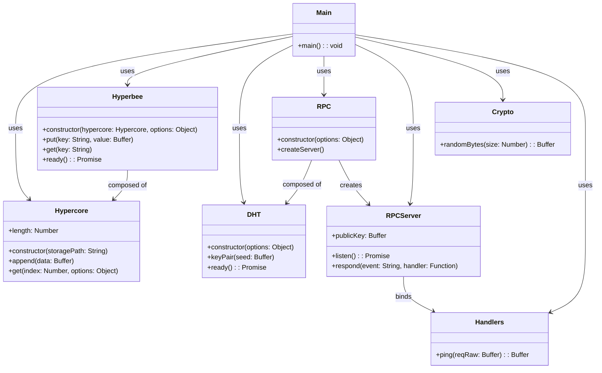
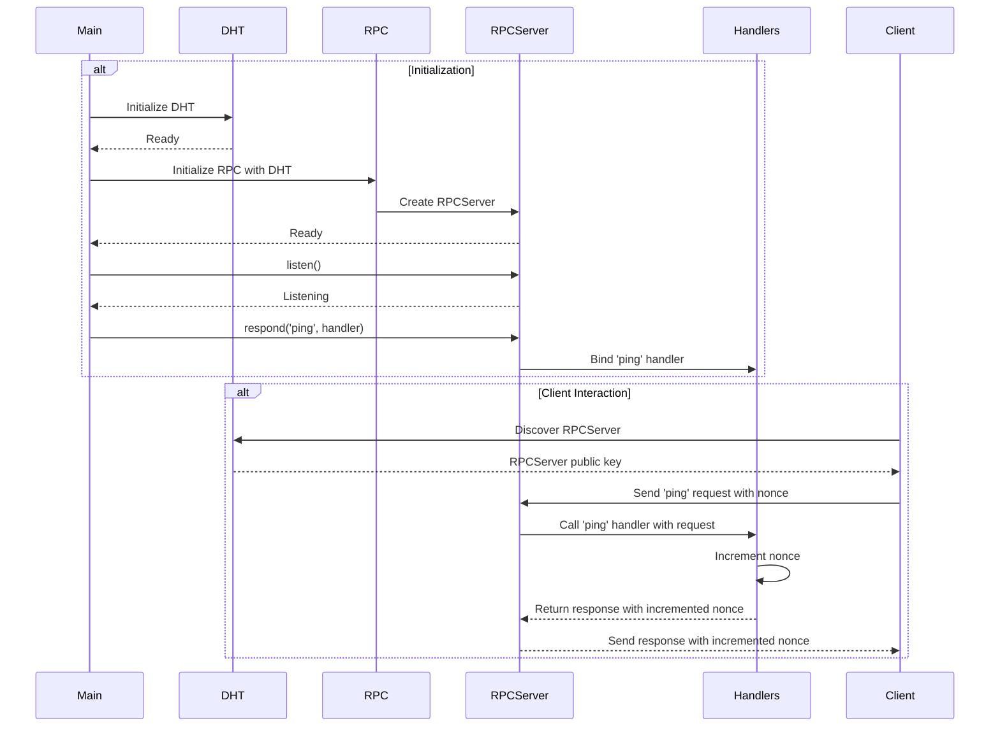

# Simple Hyperswarm RPC Server and Client

Project started from https://gist.github.com/vigan-abd/9635f60ffab2311ce7acab3ddc864973

## Components diagram

```mermaid
classDiagram
    class Main {
        +main(): void
    }

    class Hypercore {
        +constructor(storagePath: String)
        +append(data: Buffer)
        +get(index: Number, options: Object)
        +length: Number
    }
    
    class Hyperbee {
        +constructor(hypercore: Hypercore, options: Object)
        +put(key: String, value: Buffer)
        +get(key: String)
        +ready(): Promise
    }

    class DHT {
        +constructor(options: Object)
        +keyPair(seed: Buffer)
        +ready(): Promise
    }

    class RPC {
        +constructor(options: Object)
        +createServer()
    }

    class RPCServer {
        +listen(): Promise
        +respond(event: String, handler: Function)
        +publicKey: Buffer
    }

    class Crypto {
        +randomBytes(size: Number): Buffer
    }

    class Handlers {
        +ping(reqRaw: Buffer): Buffer
    }

    Main --> Hypercore: uses
    Main --> Hyperbee: uses
    Main --> DHT: uses
    Main --> RPC: uses
    Main --> RPCServer: uses
    Main --> Crypto: uses
    Main --> Handlers: uses

    Hyperbee --> Hypercore: composed of
    RPC --> DHT: composed of
    RPC --> RPCServer: creates
    RPCServer --> Handlers: binds
```

## Sequence diagram

```mermaid
sequenceDiagram
    participant Main
    participant DHT
    participant RPC
    participant RPCServer
    participant Handlers
    participant Client

    alt Initialization
        Main ->> DHT: Initialize DHT
        DHT -->> Main: Ready
        Main ->> RPC: Initialize RPC with DHT
        RPC ->> RPCServer: Create RPCServer
        RPCServer -->> Main: Ready
        Main ->> RPCServer: listen()
        RPCServer -->> Main: Listening
        Main ->> RPCServer: respond('ping', handler)
        RPCServer ->> Handlers: Bind 'ping' handler
    end

    alt Client Interaction
        Client ->> DHT: Discover RPCServer
        DHT -->> Client: RPCServer public key

        Client ->> RPCServer: Send 'ping' request with nonce
        RPCServer ->> Handlers: Call 'ping' handler with request
        Handlers ->> Handlers: Increment nonce
        Handlers -->> RPCServer: Return response with incremented nonce
        RPCServer -->> Client: Send response with incremented nonce
    end
```